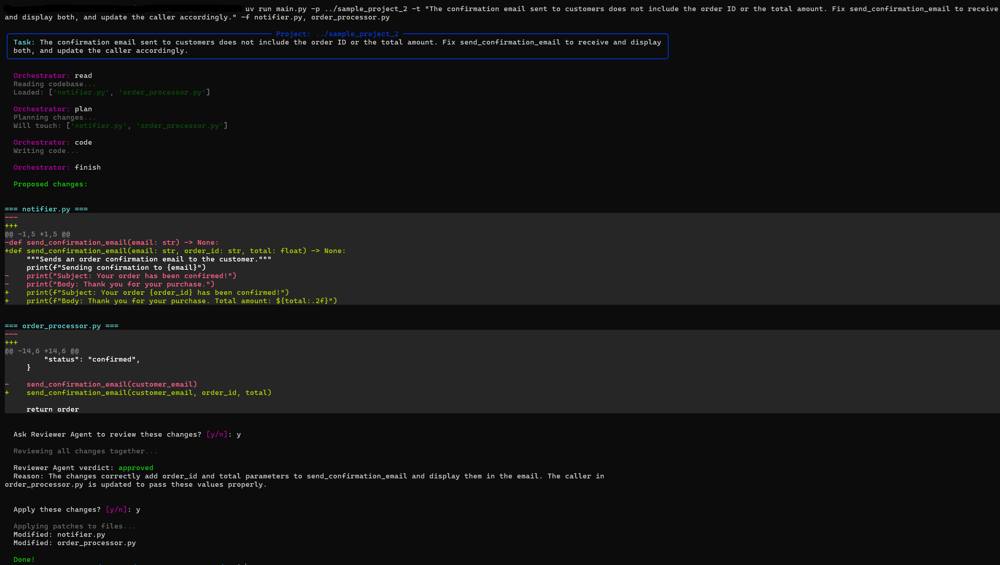

# Agentic Code Editor

A minimal multi-agent system built in pure Python that modifies code based on a task description provided by the user. No orchestration frameworks were used — the agent pipeline is implemented from scratch. Agents communicate through structured JSON and a shared history object, keeping the design explicit and easy to follow.

## How It Works

When you run the system, a control loop starts. At each iteration, the **Orchestrator** inspects the current history and decides which agent should act next. The pipeline always follows this order:

```
read -> plan -> code -> finish
```

Each step is handled by a dedicated agent:

1. **Reader** — Scans the target project folder and loads all source files into memory (Python, JS, TS, Go, and others). No LLM involved; this step is purely deterministic.

2. **Planner** — Receives the task description and the full codebase, then produces a structured JSON plan describing which files to touch and what to change in each one.

3. **Coder** — Takes each item from the plan and generates a JSON patch containing line-level operations (`replace`, `insert`, `delete`) to apply to the target file. If a previous attempt was rejected, the Coder retries using the reviewer's feedback (up to 5 attempts).

4. **Orchestrator** — A lightweight LLM agent that reads the current history and decides the next action. It has no memory of its own; all state lives in the history list.

5. **Reviewer** — An optional LLM-based code reviewer. Before applying patches to disk, the user is asked whether to invoke it. The Reviewer analyzes the full multi-file diff and returns `approved` or `rejected` with a reason.

6. **Patcher** — Not an LLM agent. Applies the approved patch operations to actual files.


## Project Structure

```
src/
├── main.py               # Entry point and main control loop
├── llm.py                # LLM client wrapper (Groq + caching)
├── history.py            # Renders history and codebase into prompt-friendly text
├── patcher.py            # Applies patches to files and saves the report
└── agents/
    ├── orchestrator.py   # Decides the next action based on current history
    ├── reader.py         # Scans the project folder and loads file contents
    ├── planner.py        # Produces a JSON change plan from the task + codebase
    ├── coder.py          # Generates line-level patch operations for each file
    └── reviewer.py       # Reviews the diff and approves or rejects the changes
```

## Demo

**Terminal output during execution:**




## Usage

**1. Clone the repository and install dependencies:**

```bash
git clone <repo-url>
cd mini_cursor
uv sync
```

**2. Set up your API key ([Groq](https://groq.com/)):**

```bash
GROQ_API_KEY="<your_api_key>"
```

**3. Run against a project:**

```bash
cd src
python main.py --project ../sample_project_1 --task "Fix the bug where passwords are stored in plain text"
```

**Optional flags:**

| Flag | Short | Description |
|---|---|---|
| `--project` | `-p` | Path to the project folder to modify |
| `--task` | `-t` | Natural language description of the task |
| `--files` | `-f` | Restrict the agent to specific files only |

**Example without file filter:**

```bash
uv run main.py -p ../sample_project_2 -t "The confirmation email sent to customers does not include the order ID or the total amount. Fix send_confirmation_email to receive and display both, and update the caller accordingly."
```

**Example with file filter:**

```bash
uv run main.py -p ../sample_project_1 -t "Fix the bug where passwords are stored in plain text" -f auth.py
```

## LLM and Caching

The system uses [Groq](https://groq.com/) as the LLM provider with the `qwen/qwen3-32b` model. All calls to the Planner and Coder are cached locally in `src/.cache/` using an MD5 hash of the prompt. This avoids redundant API calls when testing.

The Orchestrator and Reviewer bypass the cache.

## Dependencies

| Package | Purpose |
|---|---|
| `groq` | LLM API client |
| `rich` | Terminal formatting |
| `python-dotenv` | Load environment variables from `.env` |


`sample_project_1/` and `sample_project_2/` at the repository root are example projects included for testing the agent.
